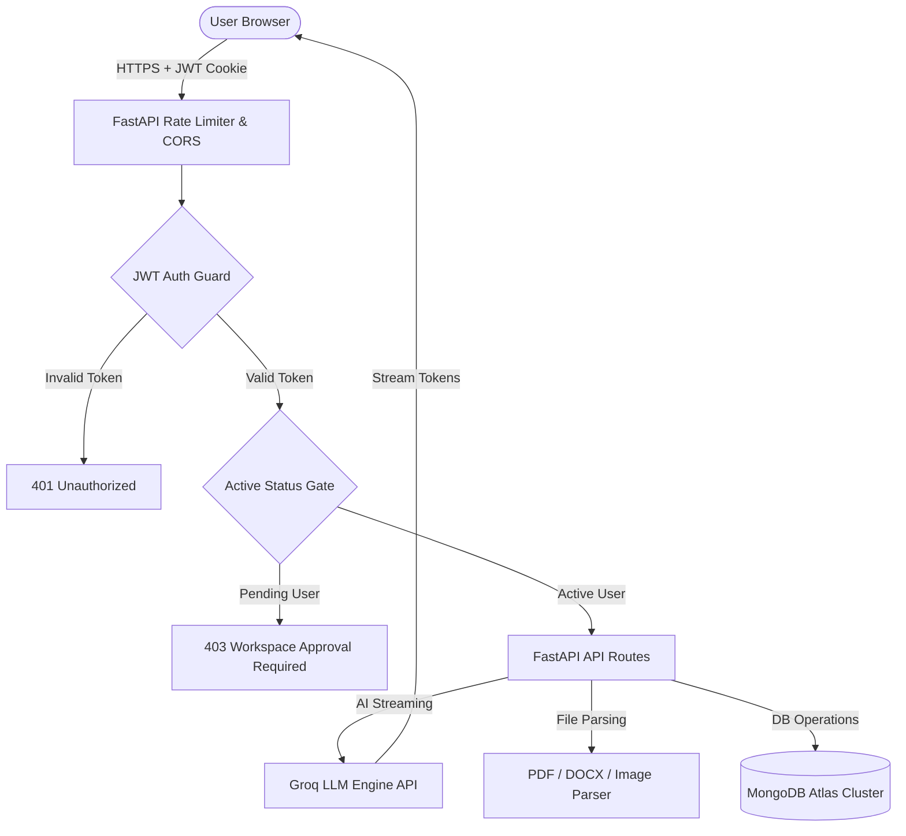

<p align="center">
  <h1 align="center">⚡ SARVA AI</h1>
  <p align="center"><strong>Open-Source Reference Implementation for Full-Stack Conversational AI & RAG Platforms</strong></p>
  <p align="center">
    <a href="https://sarva-ai-one.vercel.app/"></a>
    <a href="#-license"></a>
    <a href="CONTRIBUTING.md"></a>
  </p>
  <p align="center">
    
    
    
    
    
  </p>
</p>

---

## 💡 What is SARVA AI?

**SARVA AI** is an open-source, **production-style reference implementation** and full-stack platform for building modern conversational AI applications. It demonstrates how to connect a **React 18/19** frontend with an asynchronous **FastAPI** backend, stream high-speed LLM responses via **Groq**, manage persistent chat memory in **MongoDB Atlas**, parse uploaded documents (PDF, DOCX, TXT, images), and enforce role-based access control (RBAC) with httpOnly cookie JWT authentication.

Whether you're building a side project, an enterprise chatbot internal tool, or learning full-stack AI architecture, SARVA AI gives you a modular boilerplate to learn from and modify.

---

## 🍴 Why Fork SARVA AI?

Fork SARVA AI if you want a working starting point for building your own AI chatbot or document analysis tool. You can reuse and adapt:

- **React + FastAPI Application Blueprint**: Modular frontend and backend structure configured with CORS and environment management.
- **Groq LLM Response Streaming**: Clean Python & JavaScript patterns for ultra-low latency token streaming.
- **httpOnly Cookie JWT Authentication**: Secure authentication pipeline with organization status gates.
- **MongoDB-Backed Conversation History**: Non-blocking async database queries (`Motor`) for session memory and indexing.
- **Document Analysis Pipeline**: In-memory text extraction for PDF, Word documents, text files, and images.
- **Glassmorphic UI & State Management**: Polished chat UI with markdown rendering, syntax highlighting, and feedback modals.

### How to Build Your Own Version:

1. **Fork this repository** on GitHub.
2. **Clone your fork**:
   ```bash
   git clone https://github.com/YOUR_USERNAME/sarva-ai.git
   cd sarva-ai
   ```
3. **Configure Environment Variables**: Add your `GROQ_API_KEY` and `MONGO_URI`.
4. **Customize & Expand**: Swap LLM models, add vector databases, or customize the glassmorphic styling!

---

## 📐 System Architecture

SARVA AI isolates responsibilities into a responsive Single-Page Application (SPA), an asynchronous FastAPI REST server, and a high-performance database & LLM engine layer.

```
                 ┌─────────────────────────────┐
                 │       React Frontend        │
                 │   (Vite + Framer Motion)    │
                 └──────────────┬──────────────┘
                                │  Axios (JWT httpOnly Cookie)
                                ▼
                 ┌─────────────────────────────┐
                 │       FastAPI Backend       │
                 │  (Rate Limiter + Auth Gate) │
                 └──────────────┬──────────────┘
                                │
         ┌──────────────────────┼──────────────────────┐
         ▼                      ▼                      ▼
┌─────────────────┐    ┌─────────────────┐    ┌─────────────────┐
│    Groq Cloud   │    │  MongoDB Atlas  │    │  Document / RAG │
│  LLM Streaming  │    │  (Motor Async)  │    │ Text Extraction │
└─────────────────┘    └─────────────────┘    └─────────────────┘
```

### Flow Diagram



---

## 🛠 Tech Stack

| Layer | Technology | Description |
|:---|:---|:---|
| **Frontend** | `React`, `Vite`, `Framer Motion`, `Axios`, `Vanilla CSS` | Glassmorphism SPA with dark/light themes & Framer Motion transitions |
| **Backend** | `Python 3.10+`, `FastAPI`, `Uvicorn`, `PyJWT`, `Bcrypt` | Asynchronous REST server with rate limiting, status gates, and CORS |
| **Database** | `MongoDB Atlas`, `Motor` | Non-blocking async Python driver for chat history and session indexing |
| **AI Inference** | `Groq Cloud API` | Low-latency LLM streaming response pipeline (Llama 3 models) |
| **Document Processing** | `PyPDF`, `python-docx`, `Pillow` | In-memory text extraction for PDF, Word documents, and images |
| **Security** | `JWT (httpOnly cookies)`, `Bcrypt`, `RateLimiter` | IP rate limiting (200 req/min), status gates, parameter validation |

---

## ✨ Key Features

### 💬 AI Conversational Engine
- **Groq LLM Streaming**: Real-time token delivery for fast, responsive chat sessions.
- **Markdown & Code Highlighting**: Syntax highlighting for code blocks with one-click copy to clipboard.
- **Document & File Analysis**: Upload and analyze PDFs, Word documents, text files, and images directly in chat.
- **Message Feedback System**: Like/Dislike interactions with contextual feedback collection.
- **Session Persistence**: Rename, delete, search, and switch between previous conversations.
- **Shared Chat Links**: Generate shareable URLs to collaborate on conversations across accounts.

### 🏢 Organization & Workspace Workflows
- **Multi-Tenant Workspaces**: Organization creation with automatic Head/Owner assignment.
- **Approval Queue**: Head & HR workspace approval flow with bulk-approval & rejection tools.
- **Invitation System**: Tokenized invite codes for pre-approved team onboarding.
- **Role-Based Access Control (RBAC)**: Permission matrix (`Head` → `HR` → `Team Lead` → `Executive` → `Intern` → `Student`).
- **Department & Member Directory**: Department allocation, role updates, member search, and archiving.

---

## ⚡ Quick Start

Follow these steps to run SARVA AI locally.

### Prerequisites
- **Node.js** v18+ and **npm**
- **Python** 3.10+
- **MongoDB Atlas** database connection string (or local MongoDB)
- **Groq API Key** ([Get a free key from Groq Console](https://console.groq.com/))

---

### 1. Clone the Repository

```bash
git clone https://github.com/karangarg-igt/sarva-ai.git
cd sarva-ai
```

---

### 2. Backend Setup (FastAPI)

```bash
cd backend

# Create Python virtual environment
python -m venv venv

# Activate virtual environment
# On macOS/Linux:
source venv/bin/activate
# On Windows:
# venv\Scripts\activate

# Install Python dependencies
pip install -r requirements.txt

# Create .env configuration file
cp .env.example .env
```

Edit your `backend/.env` file with your credentials:
```env
MONGO_URI=mongodb+srv://<username>:<password>@cluster.mongodb.net/?retryWrites=true&w=majority
DATABASE_NAME=sarva_ai
GROQ_API_KEY=gsk_your_groq_api_key_here
SECRET_KEY=your_super_secret_jwt_key
FRONTEND_URL=http://localhost:5173
```

Start the FastAPI backend server:
```bash
uvicorn main:app --reload --port 8000
```
*Backend runs at `http://localhost:8000` (Swagger documentation at `http://localhost:8000/docs`).*

---

### 3. Frontend Setup (React + Vite)

In a new terminal window:

```bash
cd frontend

# Install Node dependencies
npm install

# Create .env configuration file
cp .env.example .env

# Start Vite development server
npm run dev
```
*Frontend runs at `http://localhost:5173`.*

---

## 🔐 Environment Variables

### Backend (`backend/.env`)
| Variable | Required | Description | Example |
|:---|:---:|:---|:---|
| `MONGO_URI` | Yes | MongoDB Atlas connection string | `mongodb+srv://...` |
| `DATABASE_NAME` | Yes | MongoDB database name | `sarva_ai` |
| `GROQ_API_KEY` | Yes | Groq Cloud API key for LLM streaming | `gsk_...` |
| `SECRET_KEY` | Yes | Secret key for signing JWT tokens | `super_secret_key` |
| `FRONTEND_URL` | Optional | Allowed origin for CORS & auth cookies | `http://localhost:5173` |

### Frontend (`frontend/.env`)
| Variable | Required | Description | Example |
|:---|:---:|:---|:---|
| `VITE_API_URL` | Yes | API base URL for Axios client | `http://localhost:8000` |

---

## 📡 API Reference Overview

| Method | Endpoint | Access | Description |
|:---:|:---|:---:|:---|
| `POST` | `/api/auth/signup` | Public | Register new user or organization account |
| `POST` | `/api/auth/login` | Public | Authenticate user & set httpOnly JWT cookie |
| `POST` | `/api/auth/logout` | Authenticated | Clear authentication cookie |
| `GET` | `/api/auth/me` | Authenticated | Fetch current user session & profile |
| `POST` | `/api/chat/stream` | Active User | Stream AI response tokens from Groq API |
| `GET` | `/api/sessions` | Active User | List user's active & archived chat sessions |
| `POST` | `/api/files/upload` | Active User | Extract text from uploaded PDF/DOCX/Image |
| `GET` | `/api/org/members` | Head / HR | Fetch organization member directory |
| `POST` | `/api/org/approve-user` | Head / HR | Approve pending workspace user request |
| `GET` | `/api/health` | Public | Health check endpoint |

---

## 📁 Project Structure

```
sarva-ai/
├── backend/
│   ├── main.py                   # FastAPI app entry point, middleware & CORS
│   ├── requirements.txt          # Python dependencies (FastAPI, Motor, PyPDF, etc.)
│   ├── database/                 # Async MongoDB connection (Motor) & initializers
│   ├── middleware/               # JWT authentication guard & status gate
│   ├── routes/                   # REST endpoints (auth, chat, sessions, files, org, etc.)
│   ├── services/                 # Business logic (Groq streaming, session memory, files)
│   ├── models/                   # Pydantic schemas for request/response validation
│   └── utils/                    # Password hashing, JWT helpers, configuration
│
├── frontend/
│   ├── index.html                # Single Page Application HTML root
│   ├── vite.config.js            # Vite build configuration
│   ├── package.json              # React dependencies (React 19, Framer Motion, Axios)
│   └── src/
│       ├── main.jsx              # React mounting root
│       ├── App.jsx               # Application routes & layout state
│       ├── index.css             # Glassmorphic design tokens & CSS variables
│       ├── context/              # AuthContext for global session state
│       ├── services/             # Axios API client configured with credentials
│       ├── components/           # UI components (ChatWindow, Sidebar, FileUploader, etc.)
│       └── pages/                # Views (Home, Chat, OrgDashboard, Auth, PendingApproval)
│
├── CONTRIBUTING.md               # Guidelines for contributing to SARVA AI
├── CODE_OF_CONDUCT.md            # Contributor Covenant Code of Conduct
├── RELEASE_v1.0.0.md             # v1.0.0 Reference Release notes
└── README.md                     # Main documentation
```

---

## 🗺️ Roadmap

Planned community features and future exploration topics:

- [x] AI Chat engine with Groq LLM streaming
- [x] Persistent chat history with MongoDB Motor async driver
- [x] In-memory PDF, DOCX, TXT, and image document analysis
- [x] Organization workspaces & RBAC member approval queues
- [x] Shared chat session links
- [ ] **Streaming response UX refinement**
- [ ] **GitHub OAuth 2.0 Integration**
- [ ] **Dark / Light theme persistence in localStorage**
- [ ] **Export Chat History** (Download conversation as Markdown / JSON)
- [ ] **Multi-Model Provider Switcher** (Groq Llama 3 models, Mixtral, Gemma)
- [ ] **Vector Database RAG Integration** (ChromaDB / Qdrant retrieval)

---

## 🤝 Contributing

Contributions are welcome! Please review our [CONTRIBUTING.md](CONTRIBUTING.md) and [CODE_OF_CONDUCT.md](CODE_OF_CONDUCT.md) before submitting a pull request.

To see suggested tasks for new contributors, check [.github/ISSUE_TEMPLATE/good_first_issue_ideas.md](.github/ISSUE_TEMPLATE/good_first_issue_ideas.md).

---

## 📄 License

Distributed under the **MIT License**. See `LICENSE` for more information.

---

<p align="center">
  <sub>Built with ❤️ by <a href="https://github.com/karangarg-igt">Karan Garg</a> during internship at IGT Solutions.</sub>
</p>
