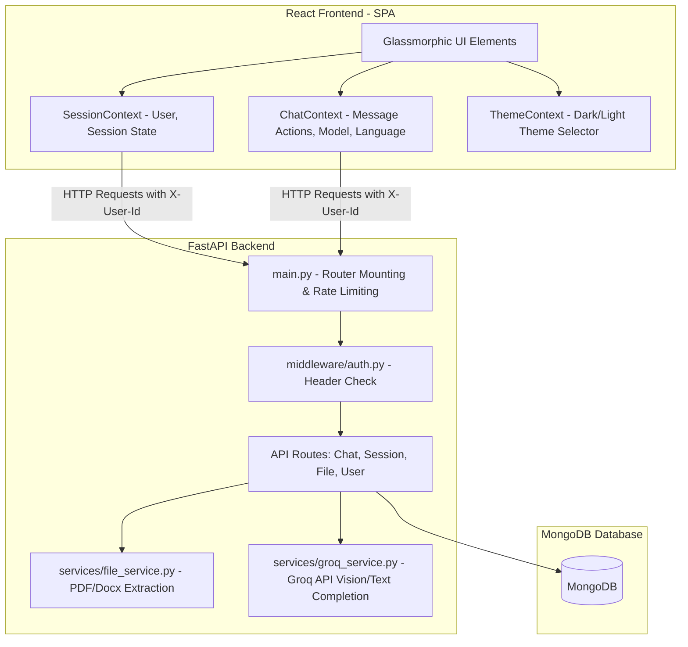

# NovaAI - Project Walkthrough & Architecture Reference

NovaAI is a full-stack, high-performance web application designed for modern team collaboration, AI-driven reasoning, and multi-format document analysis. It features a responsive, glassmorphic layout with fluid transitions and support for dark/light themes.

This document provides a complete guide to NovaAI's engineering design, database structure, APIs, and frontend state management.

---

## 🗺️ System Architecture

NovaAI is structured as a full-stack React and FastAPI codebase with a MongoDB backend:



---

## 🗄️ Database Design (MongoDB)

All application data resides in a MongoDB instance. Four key collections manage user settings, chat sessions, message histories, and uploaded file metadata:

### 1. `users`
Tracks registered client identifiers.
```javascript
{
  "_id": ObjectId("..."),
  "user_id": "uuid-string-here",
  "username": "User_last8chars",
  "created_at": "ISO-8601-timestamp"
}
```

### 2. `sessions`
Represents individual conversational sessions. Active sidebar chats map to these entries.
```javascript
{
  "_id": ObjectId("..."),
  "user_id": "uuid-string-here",
  "session_id": "uuid-string-here",
  "title": "Chat Session Title",
  "pinned": false,
  "favorite": false,
  "last_message": "Preview text of the last message...",
  "created_at": "ISO-8601-timestamp",
  "updated_at": "ISO-8601-timestamp"
}
```

### 3. `messages`
Maintains full conversations. Supports text messages and lists of attached files.
```javascript
{
  "_id": ObjectId("..."),
  "user_id": "uuid-string-here",
  "session_id": "uuid-string-here",
  "role": "user" | "assistant",
  "message": "Actual message body...",
  "files": [
    {
      "file_id": "file-uuid",
      "filename": "document.pdf",
      "file_type": "pdf",
      "file_url": "http://localhost:8000/uploads/user-id/file-uuid.pdf",
      "extracted_text": "...parsed content...",
      "saved_filename": "file-uuid.pdf"
    }
  ],
  "timestamp": "ISO-8601-timestamp"
}
```

### 4. `files`
Maintains ownership metadata for files uploaded through the service.
```javascript
{
  "_id": ObjectId("..."),
  "user_id": "uuid-string-here",
  "session_id": "uuid-string-here", // Initially empty, linked when sent in a message
  "filename": "document.pdf",
  "path": "uploads/user-id/file-uuid.pdf"
}
```

---

## 🔑 Key Features & Technical Implementations

### 1. User Isolation & Authentication
To support frictionless access without a signup flow, NovaAI isolates users using client-generated UUIDs.
* **Client-Side Storage**: On mount, [SessionContext.jsx](file:///Users/karangarg/Documents/coding/NovaAI%202/NovaAI/frontend/src/context/SessionContext.jsx) checks `localStorage` for a `novaai_user_id`. If absent, it creates a new UUID:
  ```javascript
  const getOrCreateUserId = () => {
    let userId = localStorage.getItem("novaai_user_id");
    if (!userId) {
      userId = crypto.randomUUID();
      localStorage.setItem("novaai_user_id", userId);
    }
    return userId;
  };
  ```
* **API Delivery**: The frontend configures an Axios interceptor in [api.js](file:///Users/karangarg/Documents/coding/NovaAI%202/NovaAI/frontend/src/services/api.js) to append this key as an `X-User-Id` HTTP header on every outgoing call.
* **Server Verification**: In the backend, [auth.py](file:///Users/karangarg/Documents/coding/NovaAI%202/NovaAI/backend/middleware/auth.py) extracts this identifier and verifies session ownership to guarantee absolute data privacy:
  ```python
  async def get_user_id(x_user_id: str = Header(None, alias="X-User-Id"), user_id: str = Query(None)):
      active_user_id = x_user_id or user_id
      if not active_user_id:
          raise HTTPException(status_code=401, detail="User identification required")
      return active_user_id

  async def verify_session_ownership(session_id: str, user_id: str):
      session = await db.sessions.find_one({"session_id": session_id})
      if not session or session.get("user_id") != user_id:
          return JSONResponse(status_code=403, content={"success": False, "message": "Access denied"})
      return None
  ```

### 2. Rate Limiting Middleware
To safeguard system capacity and limit api costs, an IP-based token bucket rate limiter is mounted in [main.py](file:///Users/karangarg/Documents/coding/NovaAI%202/NovaAI/backend/main.py):
* **Rate Limits**: Restricts access to a max of **60 requests per 60 seconds** per unique client IP.
* **Exceptions**: Skips pre-flight `OPTIONS` calls, static file retrieval (`/uploads`), and `/api/health` probes.
```python
@app.middleware("http")
async def rate_limiter(request: Request, call_next):
    if request.method == "OPTIONS" or request.url.path.endswith("/health") or request.url.path.startswith("/uploads"):
        return await call_next(request)
        
    client_ip = request.client.host if request.client else "unknown"
    now = time.time()
    
    if client_ip not in rate_limit_records:
        rate_limit_records[client_ip] = []
        
    # Clean records older than the window
    rate_limit_records[client_ip] = [ts for ts in rate_limit_records[client_ip] if now - ts < RATE_LIMIT_WINDOW]
    
    if len(rate_limit_records[client_ip]) >= RATE_LIMIT_CALLS:
        raise HTTPException(status_code=429, detail="Too many requests. Please slow down.")
        
    rate_limit_records[client_ip].append(now)
    return await call_next(request)
```

### 3. File Upload, Storage & Parsing
NovaAI supports document analysis across PDFs, DOCX, TXTs, and image files.
* **File Validation**: [file_service.py](file:///Users/karangarg/Documents/coding/NovaAI%202/NovaAI/backend/services/file_service.py) enforces a **10MB size limit** and checks file extensions.
* **Extraction Pipelines**:
  * **Text (`.txt`)**: Read asynchronously using UTF-8 formatting.
  * **PDF (`.pdf`)**: Read using `pypdf.PdfReader` to extract textual layers page-by-page.
  * **Word (`.docx`)**: Parsed using `docx.Document` to loop through structured paragraph elements.
  * **Images (`.png`, `.jpg`, `.jpeg`, `.webp`)**: Skipped during local parsing. Instead, the backend marks them as `[Image File]`, and encodes them into Base64 to leverage Groq Vision.
* **Isolated Folders**: Files are saved in folders named after the user's UUID (`uploads/{user_id}/{file_uuid}.ext`) to prevent filenames from colliding.

```python
async def extract_text_from_file(file_path: str) -> str:
    _, ext = os.path.splitext(file_path.lower())
    
    if ext == ".txt":
        with open(file_path, "r", encoding="utf-8", errors="ignore") as f:
            return f.read()
    elif ext == ".pdf":
        text = ""
        with open(file_path, "rb") as f:
            reader = pypdf.PdfReader(f)
            for idx, page in enumerate(reader.pages):
                text += f"--- Page {idx + 1} ---\n{page.extract_text()}\n"
        return text
    elif ext == ".docx":
        doc = docx.Document(file_path)
        return "\n".join([p.text for p in doc.paragraphs if p.text])
    elif ext in {".png", ".jpg", ".jpeg", ".webp"}:
        return "[Image File]"
    return ""
```

### 4. Smart Greetings System
To bypass expensive LLM API calls for standard pleasantries, [chat_routes.py](file:///Users/karangarg/Documents/coding/NovaAI%202/NovaAI/backend/routes/chat_routes.py) runs incoming queries through a regular expression mapping dictionary:
```python
GREETINGS_MAP = {
    r"^(hi|hello|hey|good\s*morning|good\s*evening|good\s*afternoon)$": 
        "Hello! 👋 I’m NovaAI. I can help with programming, projects, resumes, research, interview preparation, learning, and much more. What would you like to work on today?",
    r"^how\s*are\s*you(\s*doing)?$": 
        "I’m doing great and ready to help. 🚀 What can I assist you with today?",
    r"^(who\s*are\s*you|what\s*is\s*your\s*name|who\s*is\s*novaai)$": 
        "I’m NovaAI, your intelligent AI assistant designed to help with coding, learning, research, career guidance, productivity, and general questions."
}
```
If a message matches a signature regex pattern, the static greeting is saved and returned immediately without contacting Groq.

### 5. Asynchronous Title Generation
Instead of naming every chat session "New Chat", NovaAI utilizes a lightweight model (`llama-3.1-8b-instant`) to analyze the very first prompt in a session. It generates a professional 2-4 word summary, cleaning and shortening it asynchronously to keep the main chat thread responsive.
```python
async def generate_and_save_session_title(user_id: str, session_id: str, first_message: str):
    title_prompt = f"Generate a short, professional title for a conversation starting with: '{first_message}'. Max 4 words, no quotes, respond with ONLY the title."
    completion = groq_client.chat.completions.create(
        model="llama-3.1-8b-instant",
        messages=[
            {"role": "system", "content": "You are a helpful assistant that generates clean conversation titles."},
            {"role": "user", "content": title_prompt}
        ],
        temperature=0.3,
        max_tokens=20
    )
    title = completion.choices[0].message.content.strip().replace('"', '').replace("'", "")
    title = "".join(c for c in title if c.isalnum() or c.isspace()).strip()
    words = title.split()
    if len(words) > 4:
        title = " ".join(words[:4])
        
    if title:
        await db.sessions.update_one(
            {"user_id": user_id, "session_id": session_id},
            {"$set": {"title": title}}
        )
```

### 6. Memory History Capping & LLM Context Assembly
To manage model context sizes and API costs, [chat_routes.py](file:///Users/karangarg/Documents/coding/NovaAI%202/NovaAI/backend/routes/chat_routes.py) loads full chat history but caps the context sent to Groq's APIs to the **last 20 messages**:
```python
history = await get_messages(user_id, session_id)
memory_history = history[-20:]
ai_response = await generate_ai_response(messages_history=memory_history, model=model)
```
Inside [groq_service.py](file:///Users/karangarg/Documents/coding/NovaAI%202/NovaAI/backend/services/groq_service.py):
* If the user's message contains images, it converts the base64 media values into a vision-supported schema and switches the target execution model to `llama-3.2-11b-vision-preview`.
* If textual files are attached, the extracted contents are prepended directly to the user's prompt as context instructions.

---

## 🎨 Frontend State & Layout Structure

The user interface uses a glassmorphic color palette with full responsiveness, layout animations (`framer-motion`), and context-based state trees:

### Context State Trees
1. **[ThemeContext.jsx](file:///Users/karangarg/Documents/coding/NovaAI%202/NovaAI/frontend/src/context/ThemeContext.jsx)**: Toggles a custom HTML attribute `data-theme="light" | "dark"`, referencing standard CSS custom properties defined in `index.css`.
2. **[SessionContext.jsx](file:///Users/karangarg/Documents/coding/NovaAI%202/NovaAI/frontend/src/context/SessionContext.jsx)**: Connects the sidebar session lists to the active chat session. Handles creating, deleting, and renaming sessions, as well as pinning and favoriting chats via a custom context menu.
3. **[ChatContext.jsx](file:///Users/karangarg/Documents/coding/NovaAI%202/NovaAI/frontend/src/context/ChatContext.jsx)**: Coordinates message histories. Handles model selection, target translation instructions, file queues, response regenerations, and transcript exports.

### Modern Layout Assets
* **Sidebar Component**: Displays chronological lists of conversations, search bars, session actions (Rename, Pin, Favorite, Delete), and access settings.
* **Chat Window**: Displays rendering blocks of messages. Features scroll layouts, typing indicators, syntax highlighting (`react-syntax-highlighter` using a custom atomDark style), copy actions, and attachment badges.
* **Markdown Parsing**: AI responses support tables, quotes, bullet points, and code boxes styled inline.
* **Preferences & statistics**: Offers model switches, target translation options, JSON/Markdown exports, and summaries of user statistics.

---

## 📁 Key File Map

For direct access to core implementations, click the links below:

* **Backend Main**: [main.py](file:///Users/karangarg/Documents/coding/NovaAI%202/NovaAI/backend/main.py) — Entry point, CORS setup, Rate limiter middleware.
* **Chat Core**: [chat_routes.py](file:///Users/karangarg/Documents/coding/NovaAI%202/NovaAI/backend/routes/chat_routes.py) — Greeting overrides, history trimming, background titles.
* **AI Service**: [groq_service.py](file:///Users/karangarg/Documents/coding/NovaAI%202/NovaAI/backend/services/groq_service.py) — Groq client connections, context structuring, image base64 conversion.
* **File Service**: [file_service.py](file:///Users/karangarg/Documents/coding/NovaAI%202/NovaAI/backend/services/file_service.py) — Validation limits, parsing libraries (PDF/Word/Text).
* **DB Connect**: [mongodb.py](file:///Users/karangarg/Documents/coding/NovaAI%202/NovaAI/backend/database/mongodb.py) — Motor asynchronous client connections.
* **State Managers**:
  * [SessionContext.jsx](file:///Users/karangarg/Documents/coding/NovaAI%202/NovaAI/frontend/src/context/SessionContext.jsx) — Core user identifiers, history fetching, state loaders.
  * [ChatContext.jsx](file:///Users/karangarg/Documents/coding/NovaAI%202/NovaAI/frontend/src/context/ChatContext.jsx) — Upload queues, sending messages, export commands.
* **Design Core**: [index.css](file:///Users/karangarg/Documents/coding/NovaAI%202/NovaAI/frontend/src/index.css) — Custom light/dark CSS variables, glassmorphic styling, and animations.
